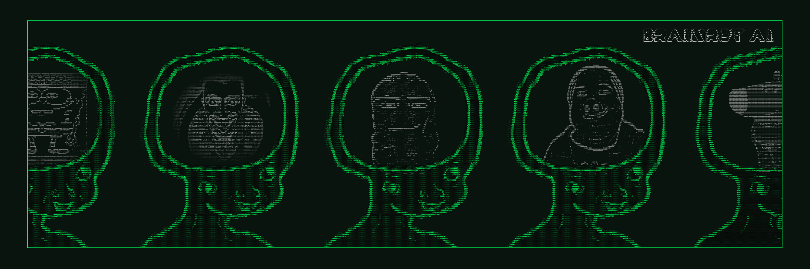

# ️‍🔥 Brainrot AI ️‍🔥

<div align="center">
  
</div>

<div align="center">
  
  [Brainrot Twitter](https://x.com/aibrainrot) | [Brainrot Website](https://www.aibrainrot.com/)
  
</div>

## 🚀 Quick Start

### Prerequisites

-   [Python 2.7+](https://www.python.org/downloads/)
-   [Node.js 22+](https://docs.npmjs.com/downloading-and-installing-node-js-and-npm)
-   [pnpm](https://pnpm.io/installation)

> **Note for Windows Users:** [WSL 2](https://learn.microsoft.com/en-us/windows/wsl/install-manual) is required.

### Edit the .env file

Copy .env.example to .env and fill in the appropriate values.

```
cp .env.example .env
```

### Automatically Start Brainrot AI

This will run everything to setup the project and start the bot with the default character.

```bash
sh scripts/start.sh
```

### Manually Start Brainrot AI

```bash
pnpm i
pnpm build
pnpm start
```
